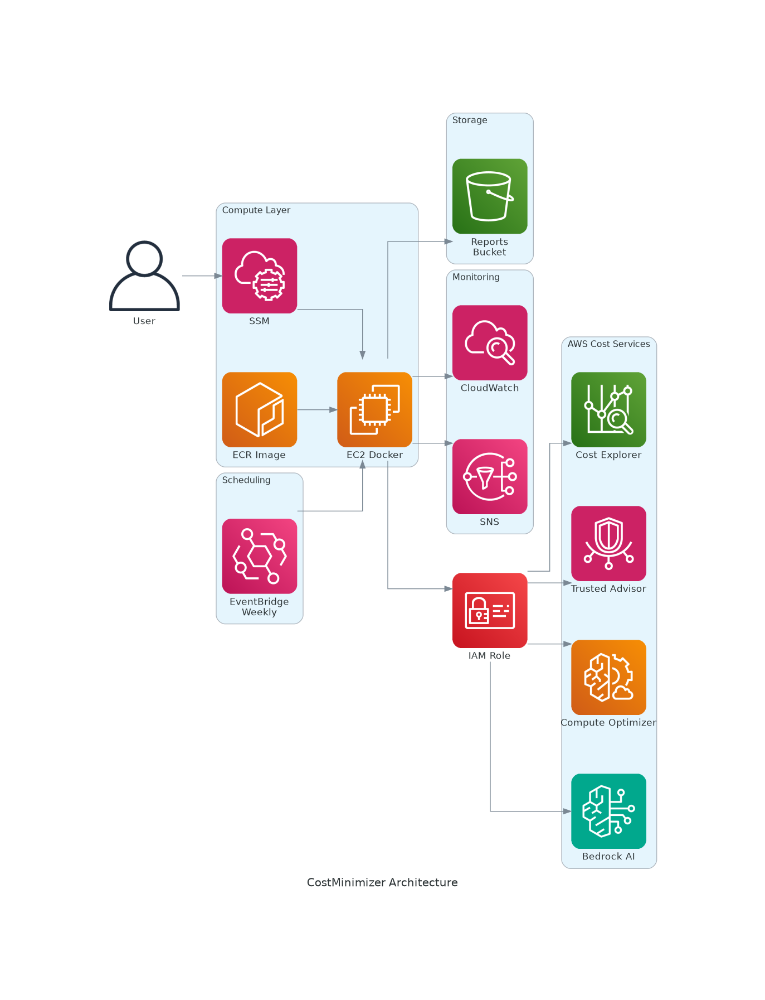

# CostMinimizer - AI-Powered AWS Cost Optimization Tool

[](https://aws.amazon.com)
[](https://docker.com)
[](LICENSE)

> Comprehensive AWS cost analysis and optimization tool leveraging Cost Explorer, Trusted Advisor, Compute Optimizer, and Amazon Bedrock AI to generate actionable cost-saving recommendations.

## 🏗️ Architecture



## ✨ Features

- **Multi-Source Data Collection**: Cost Explorer, Trusted Advisor, Compute Optimizer, CUR
- **AI-Powered Analysis**: Amazon Bedrock generates intelligent recommendations
- **Automated Reports**: Excel & PowerPoint output
- **Docker Ready**: Containerized deployment to ECR/EC2
- **Scheduled Execution**: EventBridge weekly automation
- **Secure by Default**: IMDSv2, HTTPS-only, encrypted S3

## 🚀 Quick Start

### Option 1: Docker Deployment (Recommended)

```bash
# Deploy infrastructure
aws cloudformation deploy --template-file cloudformation-deploy.yaml \
  --stack-name costminimizer --capabilities CAPABILITY_NAMED_IAM

# Build & push Docker image
./docker-deploy.sh

# Run reports
aws ssm send-command --instance-ids <INSTANCE_ID> \
  --document-name "CostMinimizer-RunReports" \
  --parameters 'ReportTypes=--ce --ta --co'
```

### Option 2: Local Installation

```bash
git clone https://github.com/vanhoangkha/sample-costminimizer.git
cd sample-costminimizer
python -m venv .venv && source .venv/bin/activate
pip install -r requirements.txt
python setup.py develop
CostMinimizer --configure --auto-update-conf
CostMinimizer --ce --ta --co
```

## 📊 Usage Examples

```bash
# Cost Explorer reports
CostMinimizer --ce

# All reports with AI recommendations
CostMinimizer -r --ce --ta --co

# Ask questions about costs
CostMinimizer -q "What are my top cost savings opportunities?" -f report.xlsx
```

## 🔒 Security

| Feature | Status |
|---------|--------|
| Container CVEs (Critical/High) | ✅ 0 |
| Network Egress | ✅ HTTPS only |
| S3 Encryption | ✅ AES-256 |
| Instance Metadata | ✅ IMDSv2 |
| Access Method | ✅ SSM (no SSH) |

## 📁 Project Structure

```
├── src/CostMinimizer/     # Main source code
├── Dockerfile.secure      # Hardened Docker image
├── cloudformation-deploy.yaml  # Infrastructure as Code
├── docker-deploy.sh       # ECR build script
├── iam-policy.json        # IAM permissions
└── requirements.txt       # Python dependencies
```

## 💰 Cost Estimate

| Resource | Monthly Cost |
|----------|-------------|
| EC2 t3.medium | ~$30 |
| S3 + ECR + Logs | ~$1 |
| **Total** | **~$31** |

💡 Use Spot Instances to reduce to ~$10/month

## 📖 Documentation

- [Docker Deployment Guide](README_DOCKER_DEPLOY.md)
- [MCP Server Setup](MCP_SETUP.md)
- [Development Guide](DEVELOPMENT.md)

## 🤝 Contributing

Contributions welcome! Please read the [contributing guidelines](CONTRIBUTING.md) first.

## 📄 License

Apache 2.0 - See [LICENSE](LICENSE) for details.

---

**Keywords**: AWS Cost Optimization, FinOps, Cost Explorer, Trusted Advisor, Compute Optimizer, Amazon Bedrock, Docker, ECR, CloudFormation, Terraform, Cost Management, Cloud Cost Analysis
